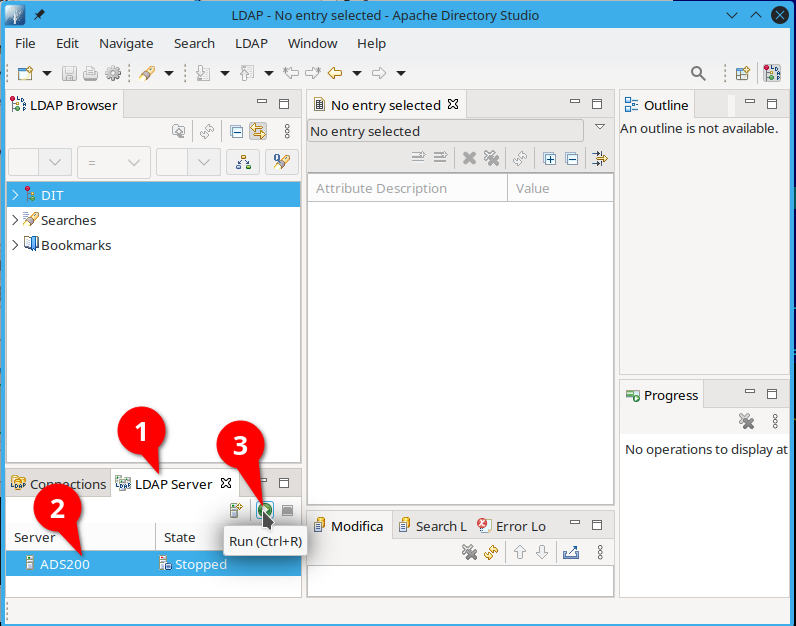
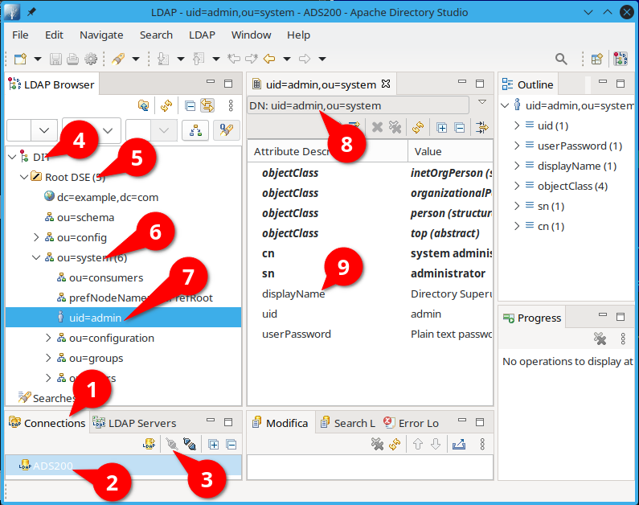
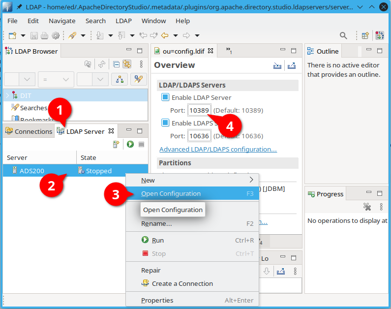
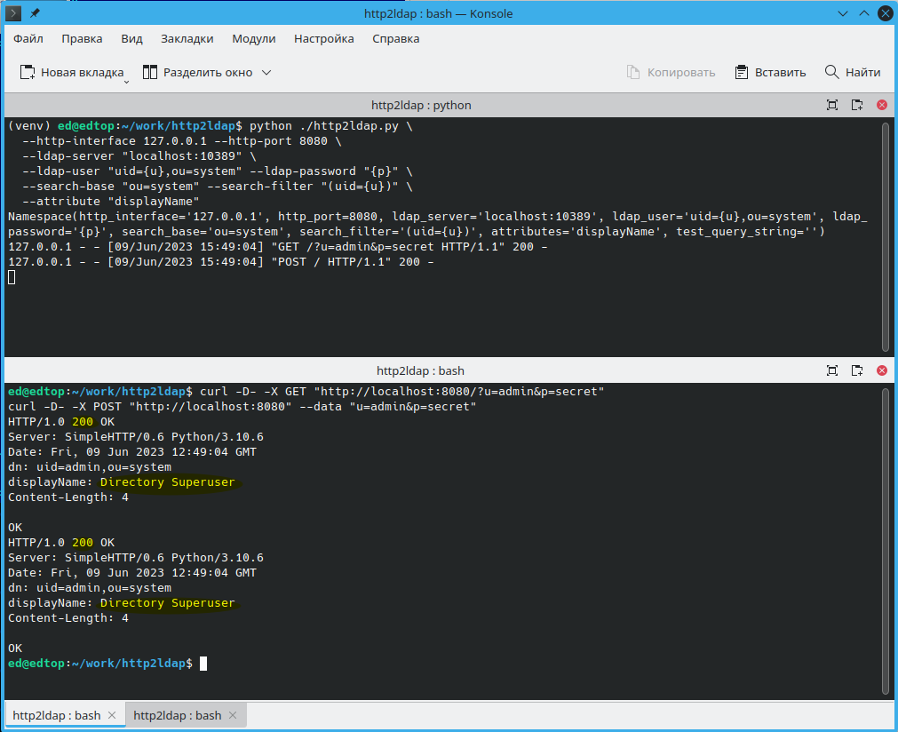

# Тестирование

## Подготовка среды разработки

* Запускаем Apache Directory Studio


1. Переходим на закладку `LDAP Server`
2. Выберем предустановленый сервер `ADS200`
3. Запустим его

* Настраиваем вертуальное окружение 

```bash
python3 -m venv venv && source venv/bin/activate && pip install -r requirement.txt
```

* Определяем параметры для настроек приложения в Apache Directory Studio

Преходим на закладку `Connections` (1). Соединяемся с предустановленным сервером (2,3).
Находим нужного пользователя `uid=admin` (4-7)

1. Определяем точное (DN) имя пользователя: `uid=admin,ou=system` (8)
2. Возвращаемый атрибут будет `displayName`
3. Порт `10389` на котором отвечает LDAP сервер можно посмотреть тут (4) 
4. Предположим что имя пользователя в форме будет передаваться в поле `u`, а пароль в `p`.
5. Приниматься запросы будут на порту `8080` локального сетевого интерфейса `127.0.0.1`

* Запускаем приложение для этих настроек

```bash
python ./http2ldap.py \
  --http-interface 127.0.0.1 --http-port 8080 \
  --ldap-server "localhost:10389" \
  --ldap-user "uid={u},ou=system" --ldap-password "{p}" \
  --search-base "ou=system" --search-filter "(uid={u})" \
  --attribute "displayName"
```

* Запускаем тестовыйе GET и POST запросы:

```bash
curl -D- -X GET "http://localhost:8080/?u=admin&p=secret"
curl -D- -X POST "http://localhost:8080" --data "u=admin&p=secret"
```



Видим что в обоих случаях аутентификация пользователя прошла успешно (статус `200`) и в HTTP-заголовке `displayName` вернулось значение из соответствующего LDAP атрибута.
